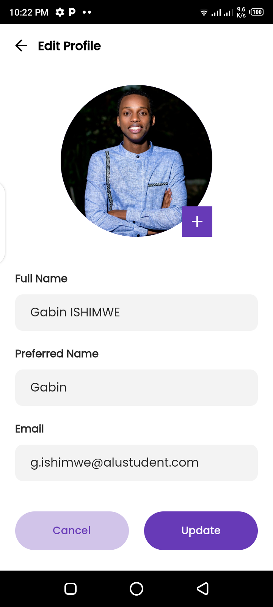

# Achievers App

  
  
  
  
  
  
  
  
    
  
  
  
  
  
  
  

## Project description

A task management mobile app that utilizes the pomodoro time management technique to help users easily create, organize, and track their daily tasks. The app will have a user-friendly interface that allows users to add new tasks, set due dates and priorities, and assign them to specific categories or projects. It will also include performance metrics to help users understand their productivity levels. The app aims to bridge the gap in existing task management apps by providing a simple yet effective solution for organizing and prioritizing daily tasks.

## Technology used

- [Flutter](https://flutter.dev/) using [Dart](https://dart.dev/) language.
- Developed in [VS code](https://code.visualstudio.com/) and [Android Studio](https://developer.android.com/studio)

- Plugins:
  - [Firebase](https://firebase.google.com/) (Firestore database and Firestore storage)

## How to install the project

Step 1: To run the program on your computer, you need to have installed git in order to clone our repository.
[How to install Git](https://www.youtube.com/watch?v=F02LEVYEmQw).

Step 2: Clone the repository and run it in your code editor.
[clone the repository](https://www.youtube.com/watch?v=aHMPn57ZmJo).

## How to run the project

Step 1: Run `flutter pub get` to install dependencies.

Step 2: Choose a device to run the program on. **Android** devices are recommended to get full functionalities of the app.

Step 3: Run `flutter run`

## How to use our project

To use our project you simply have to run it and follow instructions by the program.

#### Features:

- Sign up / Login
- Then you can:
  - Add tasks
  - View tasks on calendar
  - Manage time using task timers
  - View you time management insights
  - Edit profile when needed
- Logout

## Important files

- [Figma link](https://www.figma.com/file/UQl8G6hyN4KVRGxyGkFBED/MDV_mini-project?t=VsuDxdWgrA2uOpoV-0)
- [Project proposal](https://docs.google.com/document/d/1nksDKw0bZ9pXJs-bkGg7JWUIyg8igsvuwcM5_gl5LlQ/edit)

## Resources used

#### For mini project 3 submission

- [Setting up Firebase in our project](https://www.youtube.com/watch?v=fxDusoMcWj8&list=RDCMUCnKhcV7frITmrYbIU5MrMZw&index=4)

- Firebase authentication:

  - [Resource 1](https://www.youtube.com/watch?v=Dyu-tcX0H7M&list=RDCMUCnKhcV7frITmrYbIU5MrMZw&index=3)

  - [Resource 2](https://www.youtube.com/watch?v=4vKiJZNPhss&t=290s)

- [Animation](https://www.youtube.com/watch?v=uWiQoQSa8qA&t=11s)

## Authors

- [@AdrineUWERA](https://www.github.com/AdrineUWERA)
- [@Gabin-ishimwe](https://www.github.com/Gabin-ishimwe)
- [@UmubyeyiEvelyne](https://www.github.com/UmubyeyiEvelyne)
